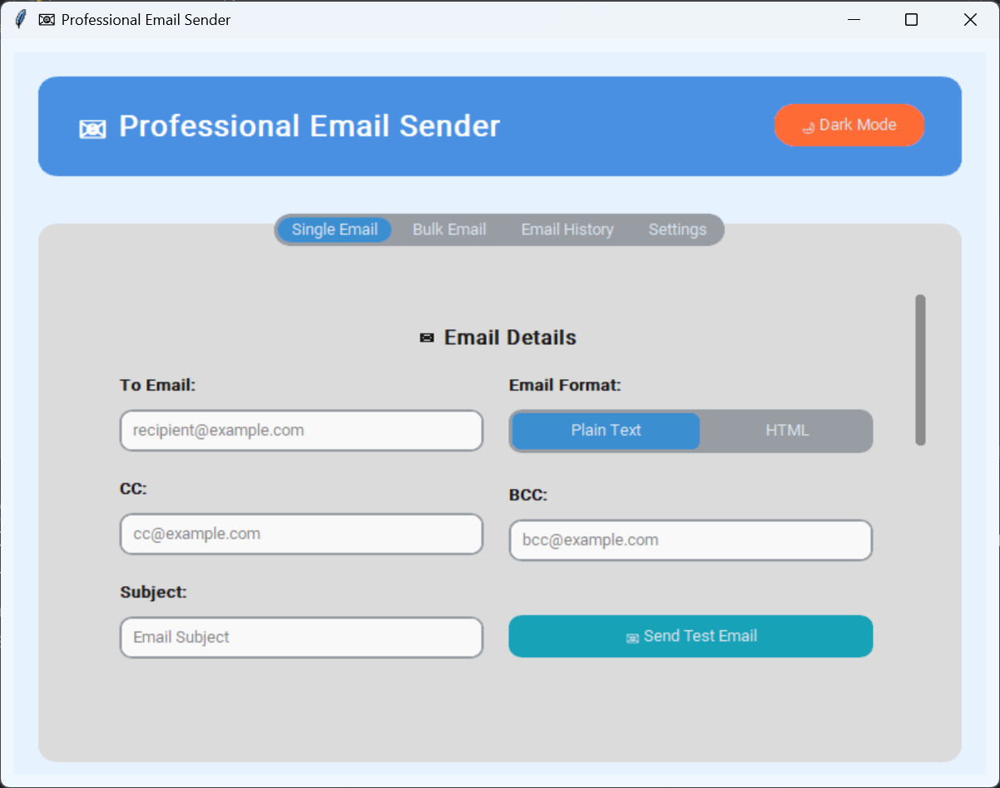
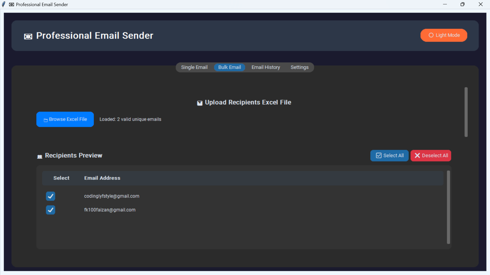
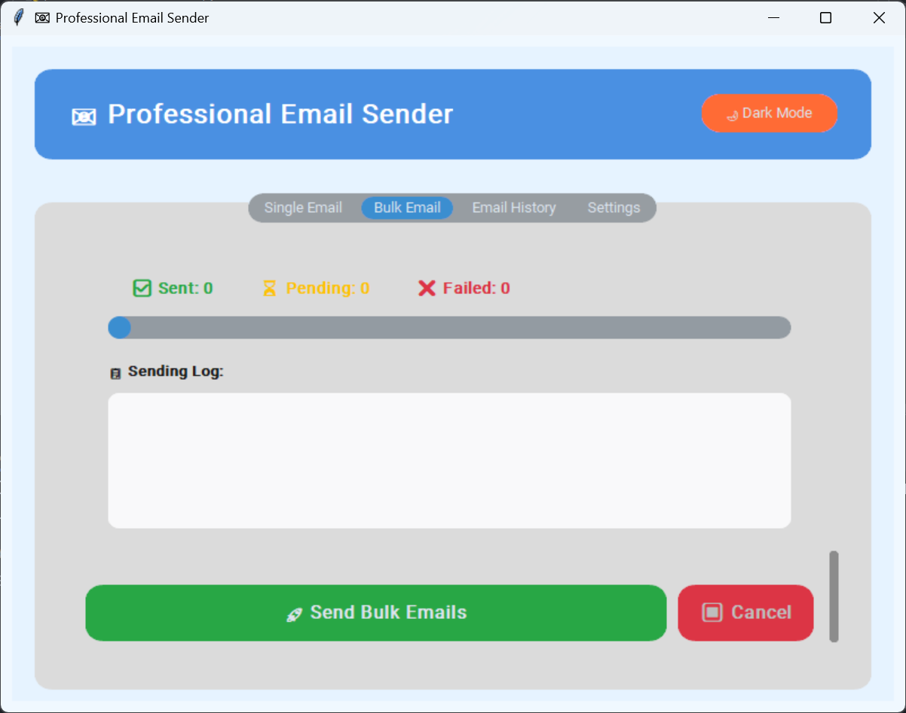
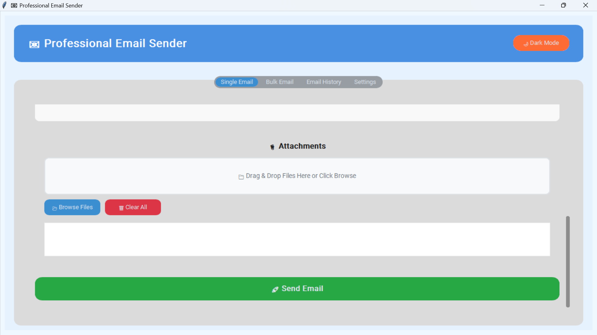
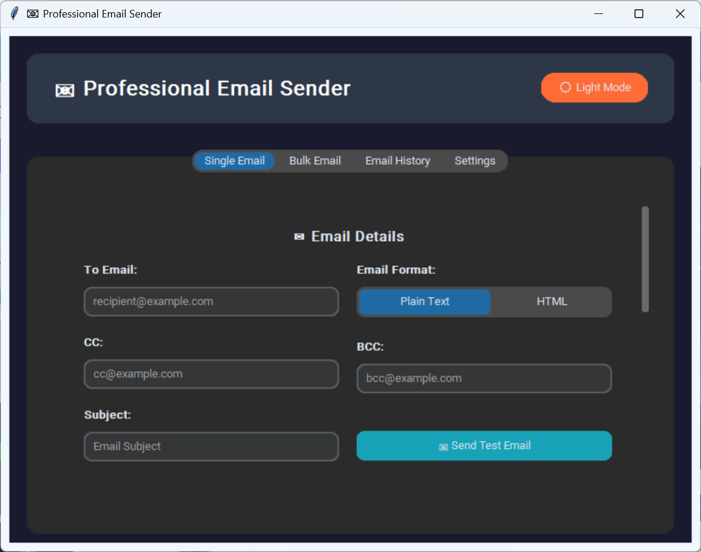

# Bulk Email Sender

## Overview

Desktop bulk-email application with contact lists, scheduling support, templates and licensed activation flow.

## Project Timeline

Development period: Approximately 2025 (source files dated 2025-09 through 2025-11; timeline approximate, no Git history).

## Key Features

- Bulk sending with templates and attachments
- Contact import and send history
- Date scheduling and licensed activation

## Technologies

Python, CustomTkinter, TkinterDnD, pandas, pygame, tkcalendar, cryptography (Fernet)

## Development

Development: AI-assisted. Requirements, database schema, UI direction, customization, debugging, testing and integration were done by the author; AI tooling assisted with scaffolding and boilerplate.

## Screenshots







## Requirements

Python 3.10 or newer recommended.

## Installation

```
python -m venv venv
venv\Scripts\activate
pip install -r requirements.txt
```

## Environment Variables

Copy `.env.example` to `.env`. Generate a stable key with `python key.py` after setting `EMAIL_APP_FERNET_KEY`, and configure `SMTP_EMAIL` / `SMTP_PASSWORD` (app password). Never commit real keys.

## Running the Application

```
python main.py
```

## Demo Credentials

No demo inbox is shipped. Use your own test mailbox. Past send history and profiles were removed from this copy.

## Limitations

- Requires SMTP access; bulk sending is rate-limited by providers.
- Licensing is a demo-level Fernet check, not enterprise DRM.

## Future Improvements

- Bounce handling and delivery analytics.
